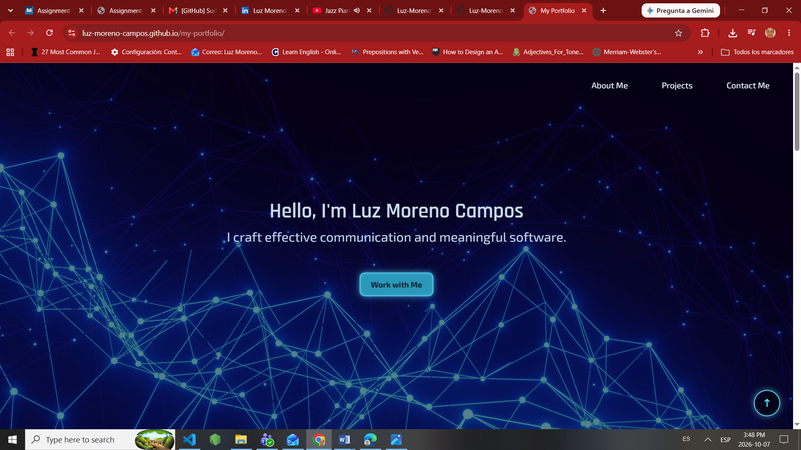

# Personal Portfolio Website

## Overview

This portfolio website showcases my background, skills, and projects as a Software Development student and communication professional.

The site includes:

- About Me section
- Project showcase
- Contact information
- Resume download
- Responsive design for different screen sizes

## Technologies Used

- HTML5
- CSS3
- JavaScript
- Git
- GitHub Pages

## Features

- Responsive layout
- Project portfolio section
- Professional profile photo
- Downloadable resume
- Smooth navigation

## About Me

I am a Software Development student at MITT with a professional background in translation, language education, marketing research, and communication. I am passionate about creating digital solutions that combine technology, communication, and design.

##  Web Portfolio Screenshot

## Future Improvements

- Add additional projects
- Improve accessibility
- Add interactive elements

## Author

**Luz Moreno Campos**

- LinkedIn: https://www.linkedin.com/in/luz-moreno-campos/
- GitHub: https://github.com/Luz-Moreno-Campos
